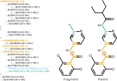
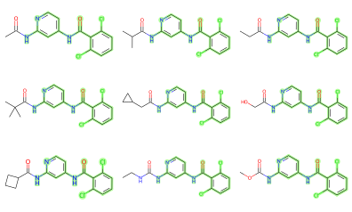

# BespokeFit Theory

BespokeFit produces molecular mechanics parameters for user-specified chemicals. These parameters are "bespoke" to the chemical. Any process of simplifying chemical reality into a classical force field makes assumptions and trade-offs, and the resulting parameters are as much a result of the process as of the chemical. BespokeFit makes assumptions designed to allow accurate parameters for a SMIRNOFF force field to be generated automatically and performantly. The process it uses and the theory behind it are documented here.

A BespokeFit run goes through five steps:

1. **Parameter selection** - The target parameters are selected and reference values are taken from the initial force field
2. **Fragmentation** - Chemicals are broken up around the target parameters for faster quantum chemical calculations
3. **SMIRKS generation** - SMIRKS patterns are constructed to identify the chemistry associated with the target parameters
4. **QC generation** - Reference data are generated via quantum chemical calculations 
5. **Parameter optimization** - The parameters are fitted to the reference QC data

## Parameter selection

A BespokeFit run begins by selecting target parameters from the target molecule. By default, BespokeFit only optimizes torsion parameters, and selects every rotatable bond whose torsion angle can be constructed without considering terminal hydrogen atoms. Other parameters can be chosen by setting the [`target_templates`] and [`target_torsion_smirks`] fields of the workflow factory.

:::{figure-md} fig-bonds
![2,6-dichloro-~{N}-[2-(2-ethylbutanoylamino)-4-pyridyl]benzamide with selected bonds highlighted](img/theory/rotatable_nonterminal_bonds.svg)

A hypothetical TYK2 ligand, highlighting each bond selected by the default BespokeFit workflow for bespoke torsion parameters.
:::

Parameter selection also involves selecting reference values for each target parameter. These reference values form a starting point for optimization later on, and are taken from the force field provided. By default, this is a mainline
OpenFF force field, but it can be any force field in the SMIRNOFF format. The reference parameter is the value the parameter would take on if the reference force field were applied. Parameters missing from the reference force field have a reference value of zero. A BespokeFit run basically involves copying the reference parameters and making them bespoke to the target molecule to improve its accuracy in the augmented final force field.

By default, BespokeFit allows the optimizer to increase the complexity of a torsion profile by expanding any reference torsion parameters with periodicities $n_i$ from 1 to 4.

$$U(\phi) = \sum_{i=1}^N k_i (1 + \cos(n_i \phi - \psi_i))$$

This can be configured in the [`smirk_settings`] field of the workflow factory. This is a conservative approach that is often not needed; in these cases, added complexity is avoided because the barrier heights $k_i$ are kept close to zero by the optimizer, which prefers solutions with simpler parameters.

[`target_templates`]: openff.bespokefit.workflows.bespoke.BespokeWorkflowFactory.target_templates
[`target_torsion_smirks`]: openff.bespokefit.workflows.bespoke.BespokeWorkflowFactory.target_templates
[`smirk_settings`]: openff.bespokefit.workflows.bespoke.BespokeWorkflowFactory.smirk_settings

## Fragmentation

Quantum chemical calculations are computationally expensive, and their expense grows very quickly with the number of atoms --- much more quickly than in molecular mechanics. A QC calculation with twice as many atoms generally takes much more than twice as long to complete. Like launching rockets in stages for fuel economy, BespokeFit breaks large molecules into fragments for computational economy. These fragments are designed to be as small as possible without changing the electronic environment for a particular parameter.

BespokeFit can use any of the fragmentation engines provided by [`openff-fragmenter`] (see ). At present, only torsion drives take advantage of fragmentation. By default, BespokeFit uses fragmentation by Wiberg Bond Order.{footcite}`wbofrag`

Naively, a bond order is an integer; 1 for a single bond (single shared pair of electrons), 2 for a double bond, and so forth. The Wiberg Bond Order generalizes this to the real numbers by providing a measure of the electron overlap between atoms. A WBO of 1.3 loosely means that 1.3 pairs of electrons are shared between the two atoms at any given time. WBO fragmentation uses the WBO of a bond as a proxy for its chemical environment. 

The fragmenter starts by identifying bonds associated with a target parameter and computing their WBO in the full molecule. It then treats each selected bond as a starting point and builds it up moiety by moiety towards the full molecule. The fragment stops growing when the the WBO in the fragment is within some disruption threshold of the WBO in the full molecule. This produces the minimum fragment for each bond that preserves the bond's chemical environment. See the [`openff-fragmenter` docs] for more information and a peer-reviewed reference.

:::{figure-md} fig-fragments
![Fragments generated from 2,6-dichloro-~{N}-[2-[[(2~{S})-2-ethyl-4-oxo-butanoyl]amino]-4-pyridyl]benzamide](img/theory/fragments.svg)

Fragments generated from the above TYK2 ligand. The bond around which each fragment is built is highlighted and the original molecule is in light gray. Note that some fragments are repeated because they share an electronically decoupled region of the molecule.
:::

[`openff-fragmenter`]: https://fragmenter.readthedocs.io/en/stable/index.html
[`openff-fragmenter` docs]: https://fragmenter.readthedocs.io/en/stable/index.html

## SMIRKS Generation

Once the molecule has been fragmented, BespokeFit generates SMIRKS patterns for each parameter. SMIRKS is an extension to chemical serialization formats SMILES and SMARTS that provides a way to specify a region of a molecule and clearly mark specific atoms. SMIRNOFF force fields uses SMIRKS instead of atom types to specify the atoms to which parameters should apply. This is what allows the target parameter to be more specific in the final force field than the reference parameter.

BespokeFit must generate SMIRKS patterns for each parameter it generates so that downstream tools know when to apply them; these patterns must trade off being specific to the chemical environment in question against being transferable to other similar chemical environments. While general force fields favor generality, BespokeFit prefers specificity so that parameters can be highly optimized to the target. SMIRKS patterns generated by BespokeFit are constructed to include as much information about as many atoms as possible while being consistent across the parent molecule and any relevant fragments.

:::{figure-md} fig-smirks

TYK2 ligand series binding fragment, alongside the parent molecule and the SMIRKS pattern for a torsion parameter. The torsion parameter is labeled with a rotation arrow. The four atoms that define the torsion parameter are highlighted in orange boldface. The `:1` -- `:4` suffixes in the SMIRKS patterns for these four atoms index them as defining the torsion, while the remainder of the pattern identifies the chemistry. The atoms that vary between the fragment and parent molecule are highlighted in blue and green; they are defined in the SMIRKS as a comma-separated list of possible chemistries. The chemistry used by the parent molecule is italicized.
:::

SMIRKS patterns have two substantial advantages over atom-types for bespoke parameters. The first is that a SMIRKS pattern can encode information about the chemical environment arbitrarily far away from the atoms that the parameters actually apply to. The second is that a SMIRKS pattern can specify as much or as little information about a particular atom as is necessary for any given parameter without over-writing parameters that happen to share the same atom-types. With SMIRKS, new parameters can account for highly specific non-local effects without damaging the generality of the remainder of a force field.

For more information on how SMIRNOFF force fields use SMIRKS, see the [`openff-toolkit` docs]. For more information on SMIRKS itself, see the Daylight theory documents for [SMIRKS], [SMARTS], and [SMILES].

[`openff-toolkit` docs]: https://open-forcefield-toolkit.readthedocs.io/en/stable/users/smirnoff.html#smirnoff-and-the-toolkit
[SMIRKS]: https://www.daylight.com/dayhtml/doc/theory/theory.smirks.html
[SMARTS]: https://www.daylight.com/dayhtml/doc/theory/theory.smarts.html
[SMILES]: https://www.daylight.com/dayhtml/doc/theory/theory.smiles.html

### Torsion SMIRKS

Torsion SMIRKS generation begins by grouping symmetric torsions and treating them together. By symmetry, these torsions should have identical parameters, and this helps reduce the number of new parameters and simplify optimization. BespokeFit accomplishes this by identifying the symmetry classes of atoms in the parent molecule with RDKit or OpenEye and labeling torsions with the symmetry classes of their atoms. Two atoms will have the same symmetry class if and only if they are symmetry-equivalent, so symmetric torsions are those that share a (possibly reversed) label.

:::{figure-md} fig-symmetry
![First fragment of 2,6-dichloro-~{N}-[2-(2-ethylbutanoylamino)-4-pyridyl]benzamide with symmetry classes and symmetry-equivalent torsions labelled.](img/theory/symmetry_classes.svg)

The first fragment of the ligand, labelled with symmetry classes. Atoms with the same symmetry class are symmetry-equivalent. Below, two symmetry-equivalent torsions for the fragment are highlighted.
:::

Once a minimal set of symmetry-equivalent torsions are collected, SMIRKS patterns are generated with [ChemPer]. SMIRKS patterns are constructed to include as much chemical information about as many atoms as possible while being consistent across the parent molecule and all of the torsion's fragments. This means that the torsion will be highly specific to a single chemical environment while still being transferable between parent and fragment and to other molecules that share the computed fragment. 

Since fragments electronically decouple a parameter from the greater molecule, and since SMIRKS patterns include the entire fragment, torsion parameter SMIRKS are transferable not just among fragments within a parent molecule but also between parent molecules. As a result, the common cores of congeneric series like the ligands of TYK2 (pictured) can be parameterized once and cached. When a new molecule produces the same torsion SMIRKS, the parameter can be reused from the cache, saving the significant computational effort associated with a torsion drive.

:::{figure-md} fig-variants

9 TYK2 ligands that share the binding fragment above. The highlighted fragment matches the SMIRKS code from [above](fig-smirks), which allows the torsion to be cached and reused.
:::

[ChemPer]: https://chemper.readthedocs.io/en/latest/

## QC Generation

BespokeFit uses quantum chemical calculations for all of its reference data because it can be generated on the fly in a way that is consistent with other OpenFF force fields. Once target parameters are finalized, each fitting target that is not found in cache generates a QC reference data generation task. At present, BespokeFit can generate tasks for geometry optimizations, hessian calculations, and one dimensional torsion drives.

<!-- This is pretty light on details - should we talk about what QC data is generated? Basis set, functional/post-HF stuff, etc... -->

The executor submits tasks to a [Celery] distributed work queue. Celery workers consume tasks and run them via the QC program executor [QCEngine]. QCEngine allows BespokeFit reference data to be generated by a variety of supported programs. The results of completed tasks are cached for later runs that require the same reference data, even if they use different optimization settings or target parameters.

<!-- 
- For high throughput bespoke parameter deviation we recommend using the fantastic QCFracal distributed computing and database for quantum chemistry.
- Users can easily set up a local server and submit large datasets of torsiondrives using QCSubmit which can then be used as reference data by bespokefit via the cache update feature- need a section on how to pull down qcarchive data and cache locally. -->

[Celery]: https://docs.celeryproject.org/en/stable/index.html
[QCEngine]: https://docs.qcarchive.molssi.org/projects/QCEngine/en/stable/

## Optimization

After generating (or retrieving from cache) the required reference data, all that remains is to fit the target parameters to it. This is called optimization because the bespoke parameters are optimized to reproduce the reference data.
Successfully completed optimizations are cached so that the bespoke parameters can be reused by future molecules that share the chemical substructure and use the same optimization settings.

BespokeFit optimizes with the same method as OpenFF uses in its mainline force fields. This helps ensure that parameters are compatible and that BespokeFit is a natural extension to OpenFF force fields. Parameters are optimized with [ForceBalance]; for torsions, this works by minimizing the root mean square error between the reference potential energy surface and that produced by the bespoke force field.

ForceBalance uses a Bayesian prior distribution to avoid over-fitting and to define the range of likely values the fitted parameter may take on.{footcite}`forcebalance` Any complexity added to the force field must overcome a penalty imposed by the prior distribution. The Laplacian prior used by default is equivalent to an L1 regulariser, and is configured by setting a "prior width", which sets the range over which the parameter can vary during optimization. BespokeFit defaults to quite large priors on the torsion barrier heights ($k$) so that the optimization is not hindered by a very general reference value.

BespokeFit relaxes the QC reference energy minimum with the current best guess force field before computing the potential energy. This relaxation is performed with restraints to keep the force field energy minimum close to the QC energy minimum, while relaxing any steric clashes that may be emphasized by the functional form of the force field.

For more details, see the [OpenFF 1.0.0 Parsley paper].{footcite}`parsley`

[OpenFF 1.0.0 Parsley paper]: https://chemrxiv.org/engage/chemrxiv/article-details/610d4bc7d800ad598c40d4a6
[ForceBalance]: http://leeping.github.io/forcebalance/doc/html/index.html

:::{footbibliography}
:::